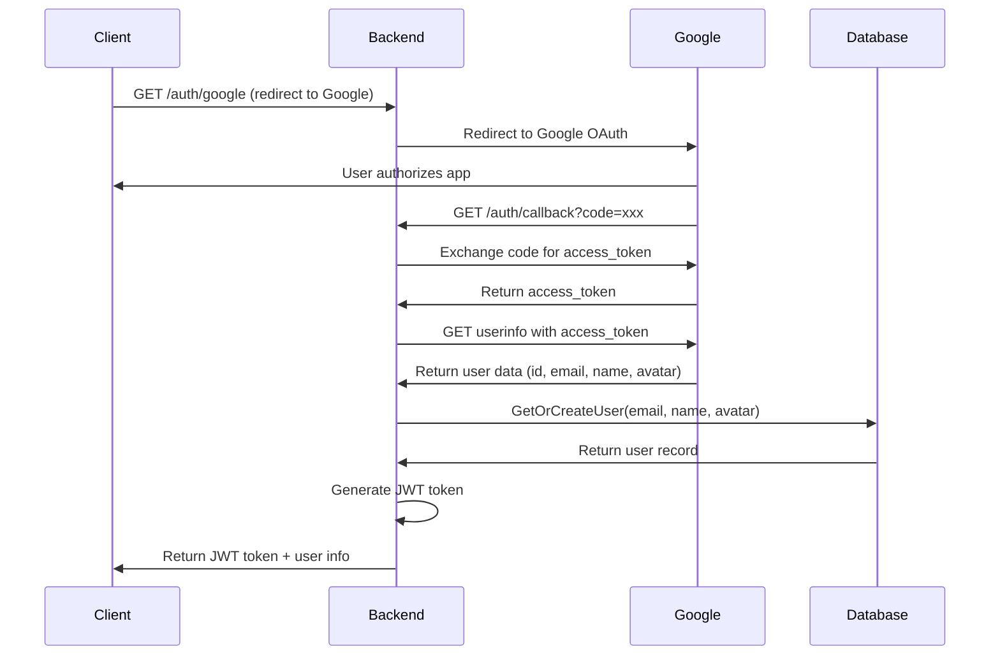

# Anochat Backend - Flow Documentation

## 🔐 Authentication Flow

### 1. Google OAuth Login Process



### 2. Core Functions Used

#### AuthService.ProcessOAuthCallback()

```go
// Main function that handles OAuth callback
func (s *AuthService) ProcessOAuthCallback(ctx context.Context, code string) (*model.User, string, error)
```

**Steps:**

1. `oauthConfig.Exchange(ctx, code)` - Exchange code for access token
2. `getUserInfoFromToken()` - Get user info from Google API
3. Verify email is verified
4. `userService.GetOrCreateUser()` - Create/find user in database
5. `generateJWT()` - Create JWT token

#### UserService.GetOrCreateUser()

```go
// Creates new user or returns existing one
func (s *UserService) GetOrCreateUser(ctx context.Context, email, name, avatarURL string) (*model.User, error)
```

**Logic:**

-   Try to find user by email
-   If not found → create new user
-   If found → return existing user

## 🎯 After JWT Login - Next Steps

### 3. JWT Token Validation & User State Check

```go
// After receiving JWT, validate and check user state
GET /user/state
Authorization: Bearer <jwt_token>
```

**Response scenarios:**

#### A. New User (First time login)

```json
{
	"user": {
		"id": "uuid",
		"email": "user@gmail.com",
		"name": "User Name",
		"avatar_url": "https://...",
		"profile": null
	},
	"room": null,
	"messages": null,
	"is_new_user": true
}
```

#### B. Existing User with Active Room

```json
{
	"user": {
		"id": "uuid",
		"email": "user@gmail.com",
		"name": "User Name",
		"avatar_url": "https://...",
		"profile": {
			"age": 25,
			"city": "Hanoi",
			"is_male": true,
			"is_hidden": false
		}
	},
	"room": {
		"id": "room_uuid",
		"user1_id": "uuid1",
		"user2_id": "uuid2",
		"category": "polite"
	},
	"messages": [
		{
			"id": "msg_uuid",
			"content": "Hello!",
			"sender_id": "uuid1",
			"created_at": "2024-01-01T10:00:00Z"
		}
	],
	"is_new_user": false
}
```

#### C. Existing User without Active Room

```json
{
	"user": {
		"id": "uuid",
		"email": "user@gmail.com",
		"name": "User Name",
		"avatar_url": "https://...",
		"profile": {
			"age": 25,
			"city": "Hanoi",
			"is_male": true,
			"is_hidden": false
		}
	},
	"room": null,
	"messages": null,
	"is_new_user": false
}
```

**Functions:**

-   `AuthService.GetUserFromToken()` - Main function that checks user state
-   `UserService.GetActiveRoom()` - Check if user has active room
-   `UserService.GetRoomMessages()` - Get room message history

**Flow Logic:**

```go
// Pseudo-code for GetUserFromToken flow
func GetUserFromToken(jwtToken) {
    1. Validate JWT → extract user_id
    2. Get user from database
    3. Check if user has active room
    4. If has room → get messages + return (user, room, messages)
    5. If no room → return (user, nil, nil)
}
```

## 📋 API Endpoints Flow

### Authentication Endpoints

-   `GET /auth/google` - Redirect to Google OAuth
-   `GET /auth/callback` - OAuth callback, returns JWT token

### User State Endpoints

-   `GET /user/state` - **Main endpoint** - JWT validation + user state check
-   `PUT /profile` - Update user profile (age, city, gender, is_hidden)

### Chat Endpoints

-   `POST /queue/join` - Join matchmaking queue
-   `PUT /room/leave` - Leave current room
-   `POST /message` - Send message (via WebSocket)

### 4. User Profile Setup (Optional - for new users)

```go
// User can update anonymous profile
PUT /profile
{
    "age": 25,
    "city": "Hanoi",
    "gender": true,  // true = male, false = female
    "is_hidden": false
}
```

**Functions:**

-   `UserService.UpdateProfile()` - Update profile fields
-   `UserService.GetProfile()` - Get current profile

### 4. Join Matchmaking Queue

```go
// User joins queue for matching
POST /queue/join
{
    "category": "polite"  // Only "polite" category available
}
```

**Flow:**

1. User sends JWT token in header
2. Backend validates JWT → gets user info
3. Add user to in-memory queue
4. Match with opposite gender + same category
5. When matched → create room

### 5. WebSocket Chat Connection

```go
// WebSocket connection
ws://host/ws
// Send JWT token in connection
```

**Events:**

-   `join_queue` - User joins queue
-   `match_found` - Match found, room created
-   `send_message` - Send chat message
-   `receive_message` - Receive message from partner
-   `leave_room` - User leaves room

### 6. Post-Chat Cleanup

**When both users leave room:**

1. `RoomService.LeaveRoom()` - Mark room as ended
2. `cleanupRoom()` - Background goroutine analyzes messages
3. Check for sensitive keywords: `["hà nội", "bikini"]`
4. If sensitive → mark `room.is_sensitive = true`
5. If not sensitive → delete all messages

## 📁 File Structure & Functions

### Core Services

#### `internal/service/auth.go`

-   `ProcessOAuthCallback()` - Main OAuth handler
-   `GetUserFromToken()` - JWT validation + user state check
-   `ValidateJWT()` - JWT validation
-   `generateJWT()` - JWT generation

#### `internal/service/user.go`

-   `GetOrCreateUser()` - OAuth user creation
-   `GetActiveRoom()` - Check user's active room
-   `GetRoomMessages()` - Get room message history
-   `UpdateProfile()` - Profile management
-   `GetProfile()` - Get user profile

#### `internal/service/room.go`

-   `CreateRoom()` - Create chat room
-   `LeaveRoom()` - End room + trigger cleanup
-   `cleanupRoom()` - Post-chat analysis

#### `internal/service/message.go`

-   `CreateMessage()` - Save chat message
-   `GetMessagesByRoomID()` - Get room messages

### Handlers

#### `internal/handler/auth.go`

-   `GoogleLogin()` - Redirect to Google OAuth
-   `GoogleCallback()` - Handle OAuth callback, return JWT

#### `internal/handler/user.go`

-   `GetUserState()` - Main endpoint for JWT validation + user state

#### `internal/middleware/auth.go`

-   `AuthMiddleware()` - JWT validation middleware

### Configuration

#### `pkg/config/chat_config.go`

```go
var ChatConfig = struct {
    Categories        []string{"polite"}
    SensitiveKeywords []string{"hà nội", "bikini"}
    MatchTimeoutSec   int{30}
}
```

## 🔄 Complete User Journey

1. **Login** → Google OAuth → JWT token
2. **JWT Validation** → Check user state (new/existing, active room, profile)
3. **Setup Profile** → Update age, city, gender (optional - for new users)
4. **Join Queue** → Select "polite" category → Wait for match
5. **Chat** → WebSocket connection → Real-time messaging
6. **Leave** → Room cleanup → Message analysis → Retention/deletion
7. **Multi-tab** → JWT validation → Auto-restore chat state

## 🛡️ Security Features

-   **JWT Validation** - All protected routes require valid JWT
-   **Email Verification** - Only verified Google emails allowed
-   **Sensitive Content Detection** - Automatic message analysis
-   **Privacy Protection** - `is_hidden` profile setting
-   **Room Isolation** - Users can only access their own rooms
-   **State Management** - Backend manages user state, not frontend
-   **Multi-tab Support** - Seamless experience across browser tabs

## 📊 Database Schema

### Users Table

-   `id` (UUID) - Primary key
-   `email` - Google email
-   `name` - Google name
-   `avatar_url` - Google avatar
-   `is_active` - Account status

### Profiles Table

-   `user_id` (UUID) - Foreign key to users
-   `age` - User age
-   `city` - User city
-   `is_male` - Gender (true=male, false=female)
-   `is_hidden` - Privacy setting

### Rooms Table

-   `id` (UUID) - Primary key
-   `user1_id`, `user2_id` - Chat participants
-   `category` - Chat category ("polite")
-   `is_sensitive` - Content flag
-   `ended_at` - Room end time

### Messages Table

-   `id` (UUID) - Primary key
-   `room_id` - Foreign key to rooms
-   `sender_id` - Foreign key to users
-   `content` - Message text
-   `created_at` - Timestamp

## 🚀 Implementation Status

### ✅ Completed

-   **Phase 1**: Foundation Setup (Database, Config)
-   **Phase 2.1**: Data Models (User, Profile, Room, Message)
-   **Phase 2.2**: Database Services (User, Room, Message)
-   **Phase 3.1**: Google OAuth + JWT (AuthService)
-   **Phase 3.2**: Auth Middleware (JWT validation middleware)
-   **Phase 3.3**: Auth Handlers (OAuth endpoints)
-   **JWT Validation Flow**: GetUserFromToken with state management
-   **Server Setup**: HTTP server with routes

### 🔄 In Progress

-   **Phase 4**: User Management (Profile handlers)

### 📋 Next Steps

-   **Phase 5**: Matchmaking System (Queue service)
-   **Phase 6**: WebSocket Chat (Real-time messaging)
-   **Phase 7**: Room Management (Cleanup logic)
