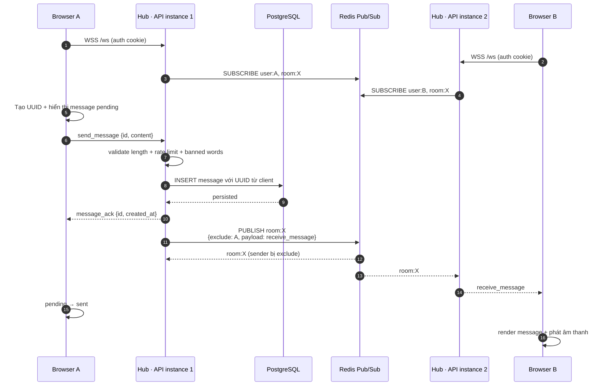
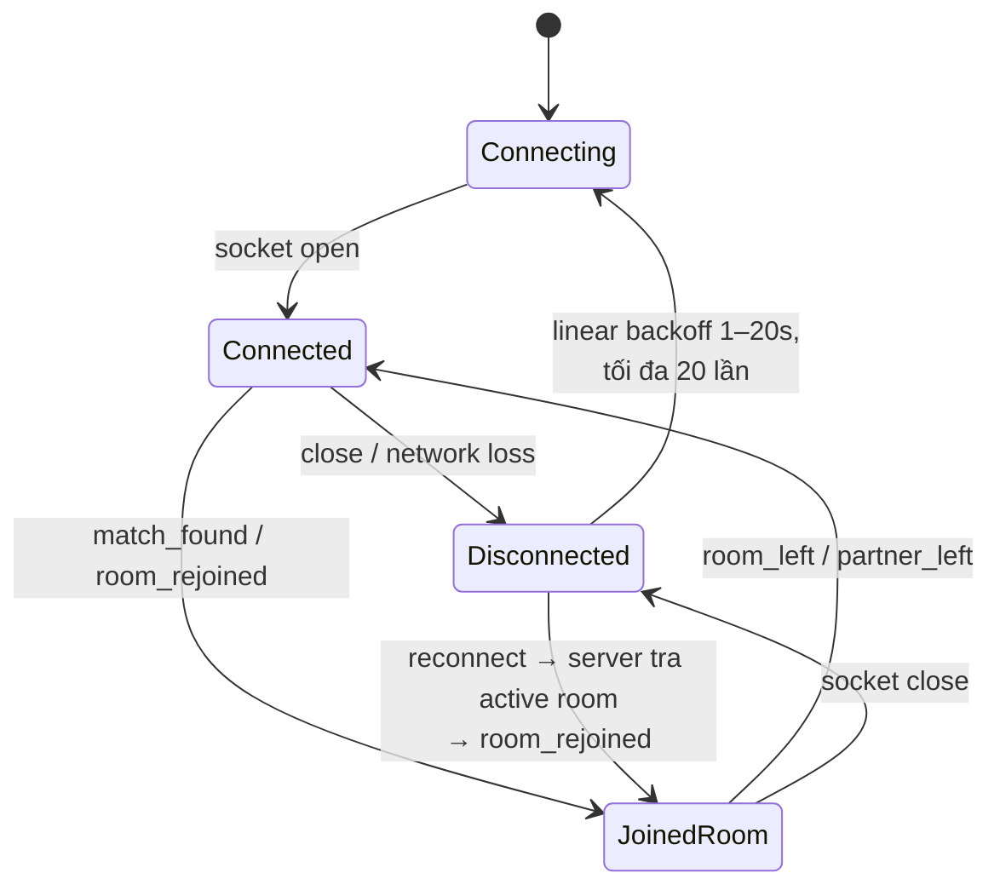
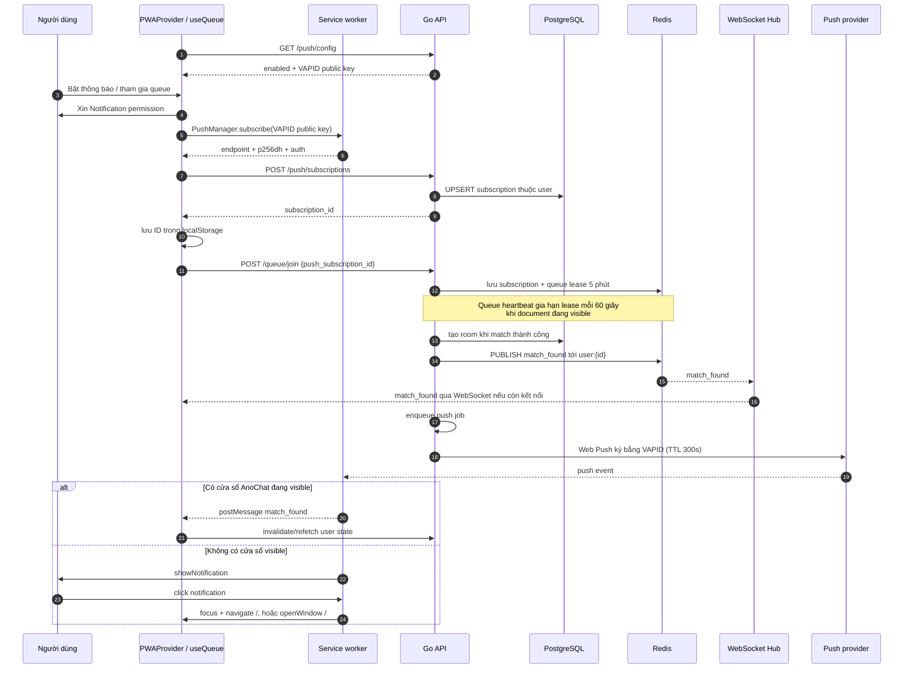

# Kiến trúc AnoChat hiện tại — WebSocket và PWA

Tài liệu này mô tả kiến trúc đang được triển khai trong codebase hiện tại. Trọng tâm là hai đường truyền tới trình duyệt:

- **WebSocket**: kết nối hai chiều khi ứng dụng đang hoạt động, dùng cho ghép đôi và chat thời gian thực.
- **Web Push qua PWA service worker**: thông báo một chiều khi ứng dụng ở nền hoặc đã đóng, hiện chỉ dùng cho sự kiện tìm thấy người trò chuyện.

## 1. Sơ đồ tổng thể

```mermaid
flowchart LR
    subgraph Device[Thiết bị người dùng]
        UI[Next.js / React UI]
        WSC[WebSocketClient singleton<br/>reconnect tối đa 20 lần]
        PWA[PWAProvider]
        SW[Service worker<br/>public/sw.js]
        Cache[Cache Storage<br/>offline shell]
        PushAPI[Browser Push API]

        UI <--> WSC
        UI <--> PWA
        PWA -->|đăng ký /sw.js| SW
        SW <--> Cache
        PWA -->|subscribe VAPID| PushAPI
        PushAPI -. push event .-> SW
    end

    subgraph Edge[HTTP / WSS]
        FE[Next.js frontend]
        API[Go API · Gin]
    end

    subgraph Runtime[Mỗi API instance]
        WSH[WebSocket handler<br/>auth + origin check]
        Hub[WebSocket Hub<br/>client/room registry]
        QS[Queue service<br/>matchmaking + lease]
        PS[Push service<br/>job buffer 128]
        SVC[Room / Message /<br/>Moderation services]
    end

    Redis[(Redis)]
    Postgres[(PostgreSQL)]
    PushService[Push service của trình duyệt<br/>FCM / APNs / vendor]

    UI -->|HTTPS REST<br/>auth, queue, history| API
    WSC <-->|WSS /ws<br/>cookie auth| WSH
    FE -->|phục vụ app UI| UI
    FE -->|phục vụ manifest,<br/>icons, sw.js| SW
    API --> QS
    API --> PS
    WSH <--> Hub
    Hub <--> SVC
    QS --> SVC
    QS <--> Redis
    Hub <-->|Pub/Sub<br/>user:{id}, room:{id}| Redis
    Hub <-->|presence| Redis
    PS -->|đọc subscription| Postgres
    SVC <--> Postgres
    PS -->|Web Push + VAPID| PushService
    PushService -. push event .-> PushAPI
```

### Vai trò của từng kho dữ liệu

| Thành phần | Vai trò chính |
| --- | --- |
| PostgreSQL | Nguồn dữ liệu bền vững: user, profile, room, message, moderation và push subscription. |
| Redis | Queue ghép đôi, reservation/lease, presence và bus Pub/Sub giữa nhiều API instance. |
| Cache Storage trong trình duyệt | Chỉ cache trang `/offline`, manifest và icon để có fallback điều hướng khi mất mạng. |

## 2. Luồng WebSocket

### Kết nối và phân phối đa instance

1. Frontend tạo một `WebSocketClient` singleton tới `ws(s)://<API>/ws`.
2. Endpoint `/ws` đi qua auth middleware, sau đó kiểm tra `Origin` phải đúng `SERVER_CLIENT_URL` trước khi upgrade.
3. Mỗi connection có một `ReadPump` và `WritePump`. Server gửi ping mỗi 54 giây; nếu không nhận pong trong 60 giây thì connection hết hạn.
4. Hub giữ connection cục bộ theo `userID`. Khi user có active room, Hub tự đưa connection vào room và gửi `room_rejoined`.
5. Mỗi API instance subscribe Redis channel `user:{userID}` cho user cục bộ. Nó chỉ subscribe `room:{roomID}` khi room có client đầu tiên trên instance đó, và unsubscribe khi client cuối cùng rời đi.
6. Vì message luôn đi qua Redis Pub/Sub, hai user vẫn chat được khi WebSocket của họ nằm trên hai API instance khác nhau.



Nếu lưu message thất bại, server trả `message_failed`. Nếu không có ACK trong 10 giây hoặc connection bị ngắt, frontend chuyển message optimistic từ `pending` sang `failed`. Lịch sử cũ được tải riêng bằng REST cursor pagination, không truyền lại toàn bộ qua WebSocket.

### Reconnect và trạng thái room



Frontend gửi lại `join_room` sau reconnect. Đồng thời server cũng tra active room trong PostgreSQL khi register client và tự add client vào room. PostgreSQL vẫn là nguồn sự thật về active room; Redis presence chỉ phản ánh trạng thái connection của room.

## 3. Luồng PWA và Web Push

### Cài đặt và offline fallback

- `manifest.webmanifest` được Next.js tạo từ `src/app/manifest.ts`: app chạy `standalone`, scope `/`, có icon thường và maskable.
- `PWAProvider` đăng ký `/sw.js`, theo dõi `online/offline`, standalone mode, iOS và sự kiện `beforeinstallprompt`.
- Service worker chỉ bắt **GET navigation request**. Nó ưu tiên network; khi network lỗi mới trả trang `/offline` đã precache.
- Chat, queue và API không được cache. AnoChat hiện là **installable PWA có offline fallback**, không phải ứng dụng chat offline-first.

### Đăng ký push và nhận thông báo ghép đôi



WebSocket event và Web Push có thể cùng xuất hiện cho một match. Đây là chủ ý: service worker không hiện notification nếu tìm thấy một cửa sổ visible, mà chỉ gửi `postMessage` để UI refresh. Khi app ở nền hoặc đã đóng, notification hệ thống là đường đánh thức người dùng.

Subscription push được ràng buộc với user ở backend trước khi gắn vào queue. Push service đọc đúng subscription đó từ PostgreSQL; endpoint trả `404` hoặc `410` sẽ bị xóa. Push job dùng queue trong memory của API instance, vì vậy nó không phải durable job queue.

## 4. Hai đường realtime bổ sung cho nhau

| Tình huống | WebSocket | Web Push / PWA |
| --- | --- | --- |
| App đang mở và có mạng | Kênh chính cho `match_found`, chat, ACK và room events. | Service worker chỉ báo UI refresh nếu nhận push. |
| App chạy nền | Connection có thể còn hoặc bị hệ điều hành suspend. | Hiện notification `match_found`. |
| App đã đóng nhưng subscription còn hiệu lực | Không có connection. | Có thể hiện notification `match_found`. |
| Mất mạng | Reconnect với backoff; chat pending chuyển failed. | Navigation fallback về `/offline`; không gửi/nhận chat offline. |
| Tải lịch sử chat | REST API cursor pagination. | Không tham gia. |

## 5. Các giới hạn kiến trúc cần nhớ

- Redis Pub/Sub không lưu lại event. Client bỏ lỡ WebSocket event sẽ khôi phục room từ PostgreSQL qua `/user/state` và `room_rejoined`, chứ không replay Pub/Sub.
- Hub hiện giữ một client mới nhất cho mỗi `userID` trên mỗi API instance; nhiều tab của cùng user không phải mô hình fan-out đầy đủ.
- Push job buffer nằm trong memory và có kích thước 128. API restart hoặc buffer đầy có thể làm mất notification, dù room đã được tạo thành công.
- Service worker chỉ cache offline shell; message chưa gửi không được lưu vào IndexedDB để retry sau.
- Web Push có thể tắt hoàn toàn bằng cấu hình. Khi tắt, chức năng chat/WebSocket vẫn hoạt động bình thường.

## 6. Bản đồ code liên quan

| Phần | File chính |
| --- | --- |
| WebSocket client + reconnect | `frontend/src/lib/websocket.ts` |
| React state, optimistic message, ACK | `frontend/src/hooks/use-websocket-chat.tsx` |
| WebSocket upgrade | `api/internal/handler/ws_handler.go` |
| Hub, Redis Pub/Sub, presence | `api/internal/ws/hub.go` |
| Server read/write pump | `api/internal/ws/client.go` |
| Xử lý message và room event | `api/internal/ws/handler.go` |
| Match notification | `api/internal/ws/notifier.go` |
| PWA state + push subscription | `frontend/src/contexts/pwa.tsx` |
| Service worker | `frontend/public/sw.js` |
| Web app manifest | `frontend/src/app/manifest.ts` |
| Web Push backend | `api/internal/service/push.go` |
| Queue lease cho background push | `api/internal/service/queue.go` |
